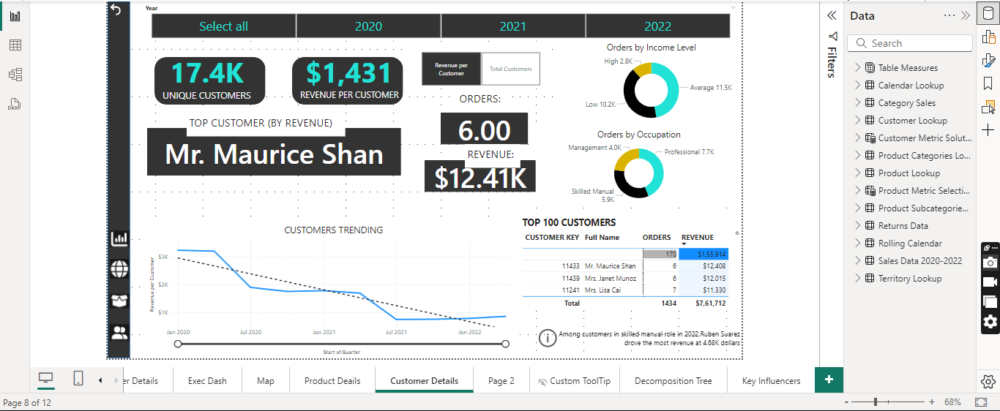

# Project: Interactive Business Insights Dashboard  

## Overview  
This project demonstrates the power of interactive visualizations using Power BI. It focuses on analyzing customer data and uncovering actionable business insights through dynamic, user-driven exploration.  

---

## Key Interactive Visualizations  

### 1. **Customer Details**  
  
   - **Description**:  
     An interactive dashboard showcasing customer demographics, purchase behavior, and revenue insights.  
   - **Interactive Features**:  
     - Dynamic filters and slicers for segmenting customers based on demographics or purchase history.  
     - Drill-through capabilities to explore individual customer data.  
   - **Use Case**:  
     Identify top-performing customer segments and develop targeted marketing strategies.  

---

### 2. **Decomposition Tree**  
  
   - **Description**:  
     A hierarchical breakdown of key metrics like revenue or churn contributors.  
   - **Interactive Features**:  
     - Click to expand nodes and drill into specific contributors to performance metrics.  
     - Real-time recalculations based on user-selected branches.  
   - **Use Case**:  
     Quickly pinpoint key drivers of business performance or areas requiring immediate attention.  

---

### 3. **Executive Dashboard**  
  
   - **Description**:  
     A high-level summary of critical business KPIs, revenue trends, and performance comparisons.  
   - **Interactive Features**:  
     - Hover-over tooltips for detailed metric descriptions.  
     - Slicers for exploring KPIs by time period, region, or product category.  
     - Real-time updates to charts and KPIs based on user selections.  
   - **Use Case**:  
     Empower decision-makers with a customizable view of business performance.  

---

### 4. **Map Visualization**  
  
   - **Description**:  
     A geospatial analysis of customer and sales data, visualized on an interactive map.  
   - **Interactive Features**:  
     - Zoom and pan functionality for exploring specific regions.  
     - Clickable data points to view detailed regional performance metrics.  
     - Filters for visualizing data by product categories or timeframes.  
   - **Use Case**:  
     Identify high-potential markets or regions requiring strategic focus.  

---

## Tools and Techniques  
- **Power BI**: Used for creating dynamic dashboards and enabling user-driven exploration of data.  
- **Interactivity**: Achieved through slicers, drill-throughs, tooltips, and dynamic recalculations.  
- **Data Sources**: Customer and sales data, preprocessed for seamless integration into Power BI.  

---

## How to Use  
1. Open the Power BI report file (or shared dashboard link).  
2. Utilize slicers and filters to explore the data by time periods, customer segments, or regions.  
3. Interact with visuals like maps and decomposition trees to drill down into specific metrics.  
4. Hover over charts to view additional details or use tooltips for contextual insights.  

---

## Highlights  
- **User-Friendly Design**: All dashboards are intuitive and accessible, catering to users with varying levels of technical expertise.  
- **Customizable Insights**: The interactive features allow users to tailor the analysis to their needs, uncovering insights specific to their questions.  
- **Real-Time Analysis**: Changes in filters or selections instantly update visuals, enabling quick decision-making.  

---
