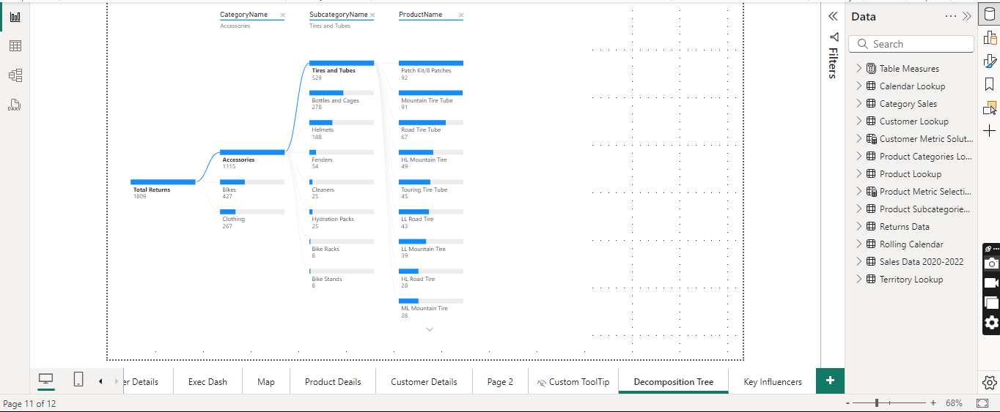

# Project: Interactive Business Insights Dashboard  

## Overview  
This project demonstrates the power of interactive visualizations using Power BI. It focuses on analyzing customer data and uncovering actionable business insights through dynamic, user-driven exploration.  

---

## Key Interactive Visualizations  

### 1. **Customer Details**  
  
   - **Description**:  
     A Power BI dashboard providing a comprehensive view of customer data, including demographics (income level, occupation), purchase behavior (orders), and revenue insights (revenue per customer, top customer revenue, revenue trends). 
   - **Interactive Features**:  
     - Dynamic filters and slicers for segmenting customers by income level and occupation.  
     - Interactive charts displaying orders by income level and occupation.
      - A sortable table of the top 100 customers by revenue and order count.
      - A trend line chart visualizing customer revenue from 2020 to 2022.  
   - **Use Case**:  
     Identify top-performing customer segments and develop targeted marketing strategies.  

---

### 2. **Decomposition Tree**  
 
  ## Product Return Analysis

This section details the analysis of product returns using a Power BI Decomposition Tree.

 **Description:**

A Power BI decomposition tree visualizing the hierarchical breakdown of total returns by product category, subcategory, and individual product. This visual allows users to understand the contribution of each product category and subcategory to the overall returns.

**Interactive Features:**

*   Click to expand nodes to drill down from product category to subcategory and then to individual products, revealing the returns associated with each level.
*   The visual dynamically recalculates and adjusts the branches based on user interaction, showing the proportional contribution of each element to the total returns.
*   Tooltips display detailed information about the returns for each category, subcategory, and product upon hover.

**Use Case:**

Quickly identify product categories, subcategories, or specific products with the highest return rates. This allows businesses to pinpoint potential issues with product quality, shipping, or customer satisfaction and prioritize areas requiring immediate attention or further investigation. For example, by exploring the tree, one can easily see if a specific subcategory within "Accessories" or a particular "Tires and Tubes" product is driving a disproportionate number of returns.

---

### 3. **Executive Dashboard**  
  
   - **Description**:  
     A high-level summary of critical business KPIs, revenue trends, and performance comparisons.  
   - **Interactive Features**:  
     - Hover-over tooltips for detailed metric descriptions.  
     - Slicers for exploring KPIs by time period, region, or product category.  
     - Real-time updates to charts and KPIs based on user selections.  
   - **Use Case**:  
     Empower decision-makers with a customizable view of business performance.  

---

### 4. **Map Visualization**  
  
   - **Description**:  
     A geospatial analysis of customer and sales data, visualized on an interactive map.  
   - **Interactive Features**:  
     - Zoom and pan functionality for exploring specific regions.  
     - Clickable data points to view detailed regional performance metrics.  
     - Filters for visualizing data by product categories or timeframes.  
   - **Use Case**:  
     Identify high-potential markets or regions requiring strategic focus.  

---

## Tools and Techniques  
- **Power BI**: Used for creating dynamic dashboards and enabling user-driven exploration of data.  
- **Interactivity**: Achieved through slicers, drill-throughs, tooltips, and dynamic recalculations.  
- **Data Sources**: Customer and sales data, preprocessed for seamless integration into Power BI.  

---

## How to Use  
1. Open the Power BI report file (or shared dashboard link).  
2. Utilize slicers and filters to explore the data by time periods, customer segments, or regions.  
3. Interact with visuals like maps and decomposition trees to drill down into specific metrics.  
4. Hover over charts to view additional details or use tooltips for contextual insights.  

---

## Highlights  
- **User-Friendly Design**: All dashboards are intuitive and accessible, catering to users with varying levels of technical expertise.  
- **Customizable Insights**: The interactive features allow users to tailor the analysis to their needs, uncovering insights specific to their questions.  
- **Real-Time Analysis**: Changes in filters or selections instantly update visuals, enabling quick decision-making.  

---
